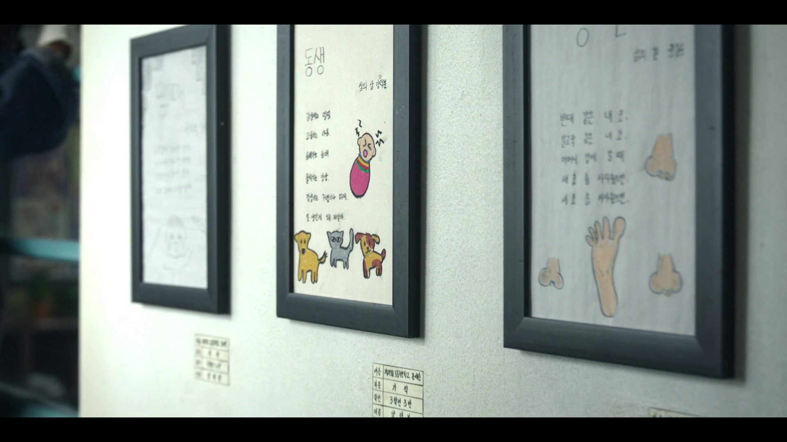
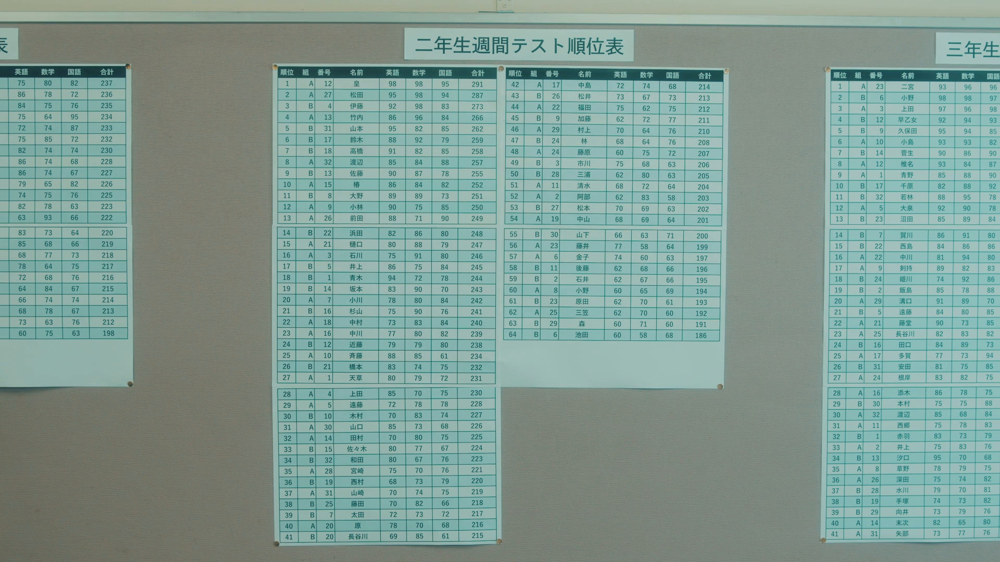

# master of movie

This is an movie OSINT challenge, you need to find out which movie these screencaps come from.

## Easy Question: Google is all you need.

Search Engine is too powerful, most of movie screencaps can be found just using google. However, if these caps are from anime, you can use more powerful websites like [saucenao]() (it can find old anime like Easy_1) and [tracemoe](https://trace.moe/) (it can find new animes like Easy_4).

I only test google search, and at least three hard images can be found using other search engines like bing, baidu and yandex. Because this challenge only ask you to find out three hard images, this challenge becomes the most solved misc challenge except signin. If you need to find some caps in your daily life, you can also use several search engines to find them out.

## Hard Question: Try to be a detective.

Hard_0 and Hard_2 are the best two questions in author's opinion, because you can gradually discover the source of images using the information in the caps. Some teams find the source of Hard_2, maybe using some powerful search engine, maybe also gradually infer it, or maybe have just watched this drama because it is very hot these days. However I didn't see any team who find out Hard_0 (maybe I neglect it), which is too obscure. I will simply narrate the solution of these two questions.

### Hard_2

There are many paintings and poems on the wall, which is wrote in Korean. If you focus on the clearest poems and try to search it, you may find nothing, because this isn't an important poem written by main characters. However, you may notice that there is something like labels in exhibition on the bottom of this picture.

You need to enlarge this part of image, find out what these Hanguls are about. You need to find a Hangul IM or website, and you can also ask AI to help you (or you can ask Korean friends to help you). You can find out the name and class of the author (like 3학년3반 in the third line), and the first line is hard to tell but important, which tells you it's an event in a school (XXXX학교) (and you might be able to find out that the last three Hanguls are 문예전 based on the environment, which isn't too important in this challenge). Asking AI letters related to 학교, it may give you 초등학교, 중학교, 고등학교, and if you ask more, it may give you 국민학교, which is very simillar with the letters in this cap. The final step is to enumerate the simillar letters to find out which elementary school it is. Using keywords like 드라마 or 영화 plus the name you guess, you will find it is 도동국민학교, and this drama is called 폭싹 속았수다.

### Hard_0

Hard_0 is easier compared with Hard_2 in my opinion.

The most important information is that this is a Japanese movie or drama, and this scene is about the scores of second year students (二年生週間テスト順位表). Also, there is a reasonable inference that the student with top ranks or worst scores may be the main character. You only need to search with keywords like ドラマ or 映画 plus 皇 and 二年生, you can quickly find out the information of this drama, and some other main characters also appear on the scoreboard.