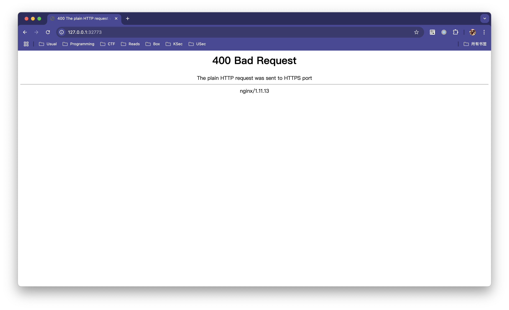

# Writeup - not-so-web-2

## Unintended Solution

As discussed in challenge-1, the cookie verification part in this challenge shoud be robust and safe. However, I just made a really stupid mistake that turn this cookie to a joke.

```py
    try:
        PKCS1_v1_5.new(public_key).verify(msg_hash, sig)
        valid = True
        # valid = PKCS1_v1_5.new(public_key).verify(msg_hash, sig)
    except (ValueError, TypeError):
        valid = False
```

That is, once your signature does not raise any exception, you get a `valid = True`.
Goddamn I should be more careful when using AI to help write crypto stuffs T.T

> the interesting part is that, if you don't audit the code carefully, you may miss this obvious error.

After the logging as admin, the SSTI part is a little different compared to the first challenge, along with some simple checks.

```py
    if payload:
        for char in payload:
            if char in "'_#&;":
                abort(403)
                return
```

Searching online or use tool like [fenjing](https://github.com/Marven11/Fenjing/tree/main) to achieve RCE.

## Intended Solution

Assume that the cookie is correctly designed, player should get confused when auditing the code. So, where is the bug?

The answer is about the HTTPS (yeah, why first challenge use HTTP but this one use HTTPS?).

For example, use HTTP to access the site will get something like:



OK wait, nginx/1.11.13, what an ancient version.

Then you may already know what's wrong here, the vulnerable part is about the nginx not about the application. The ultimate nightmare: [heartbleeding CVE-2014-0160](https://www.heartbleed.com/).

For example, using PoC like this [one](https://github.com/vulhub/vulhub/tree/master/openssl/CVE-2014-0160), you can get out-of-bounds heap read to leak server data. While the intended solution is exploiting this vulnerability to leak the real admin password.